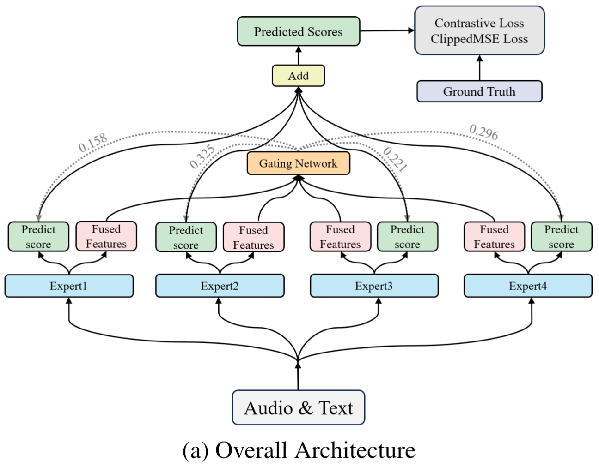
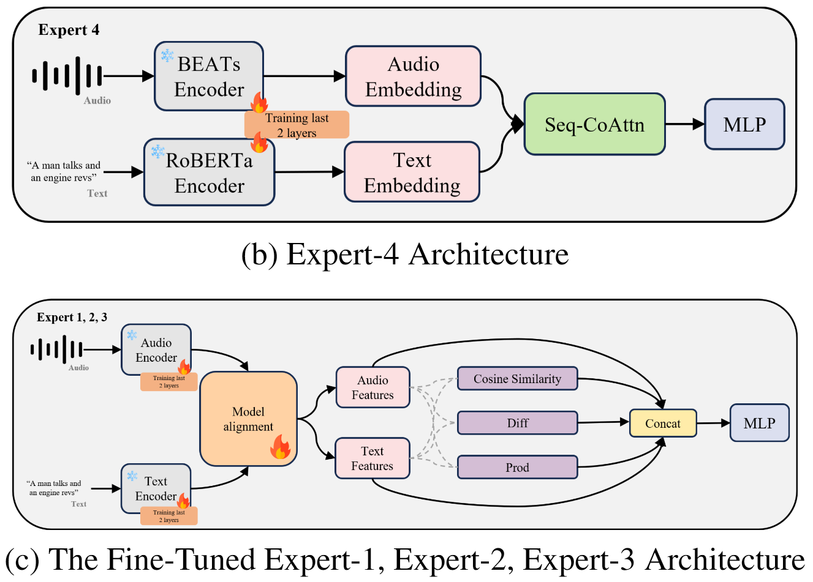

<div align="center">

# MOESCORE
### Mixture-of-Experts-Based Text-Audio Relevance Score Prediction for Text-to-Audio System Evaluation

[](https://arxiv.org/abs/2601.06829)

</div>

---

## Overview

**MOESCORE** is an objective evaluator for **text-audio relevance** in Text-to-Audio (TTA) systems.  
It is designed to assess whether a generated audio clip is semantically aligned with its input text prompt, with particular focus on:

- global semantic consistency,
- fine-grained event correspondence,
- temporal structure alignment.

Our method combines multiple complementary experts under a **Mixture-of-Experts (MoE)** framework and incorporates **Sequential Cross-Attention (SeqCoAttn)** to better model local temporal matching between audio and text.

---

## Highlights

- **1st place** in **XACLE Challenge 2026 (ICASSP 2026)**
- **SRCC: 0.6402** on the official blind test set
- **+30.6% SRCC improvement** over the challenge baseline
- A **4-expert MoE design** combining global semantic alignment and temporal correspondence
- Built for **automatic evaluation of Text-to-Audio systems**

---

## Method

### Motivation
Modern Text-to-Audio (TTA) systems can generate high-perceptual-quality audio, but they often fail to fully preserve the semantic content of the input text, resulting in mismatches in sound events, temporal structures, and contextual relationships. MOESCORE is designed as an objective evaluator to predict **Text-Audio Relevance Scores (TARS)** for synthesized audio-text pairs.

### Architecture
MOESCORE adopts a **Mixture-of-Experts (MoE)** framework to leverage complementary strengths from multiple specialized experts for TARS prediction.

Our framework consists of **four experts**:

1. **Expert 1: LAION-CLAP-based expert**  
   A dual-encoder audio-language model that provides generalizable global semantic alignment cues.

2. **Expert 2: MGA-CLAP-based expert**  
   A multi-grained CLAP variant that improves fine-grained semantic correspondence between local audio patterns and text semantics.

3. **Expert 3: M2D-CLAP-based expert**  
   A robust audio-language expert built upon self-supervised audio representation learning and CLAP-style contrastive learning.

4. **Expert 4: SeqCoAttn-based expert**  
   Built upon the baseline system with a **BEATs audio encoder**, **RoBERTa text encoder**, and a **bidirectional Sequential Cross-Attention (SeqCoAttn)** module for fine-grained temporal correspondence modeling.

For **Experts 1–3**, TARS is generated by computing the similarity between audio and text features.  
For **Expert 4**, audio layer-wise features are aggregated with learnable weights and projected to 512 dimensions, while text embeddings are aligned to the same dimension. The fused representation is obtained through bidirectional SeqCoAttn, followed by adaptive max-pooling and a two-layer MLP for score prediction.

A **feature-aware gating network** dynamically combines the outputs of all four experts, enabling the model to jointly capture **global semantic alignment** and **fine-grained temporal correspondence**.


### Loss Function

We follow the baseline loss design and use a hybrid objective consisting of:

- **Clipped Mean Squared Error (MSE) loss**
- **Margin-based contrastive loss**

The final loss is:

```math
L = \beta L_{mse} + \gamma L_{con}
```
---




---

## Main Results

### Official Blind Test Set

| Method              | SRCC ↑     | LCC ↑      | KTAU ↑     | MSE ↓      |
| ------------------- | ---------- | ---------- | ---------- | ---------- |
| Baseline            | 0.3345     | 0.3420     | 0.2290     | 4.8110     |
| **MOESCORE (Ours)** | **0.6402** | **0.6873** | **0.4612** | **3.0111** |

### Validation Set Ablation

| Method              | SRCC ↑     | LCC ↑      | KTAU ↑     | MSE ↓      |
| ------------------- | ---------- | ---------- | ---------- | ---------- |
| Expert 1            | 0.6302     | 0.6492     | 0.4542     | 3.5382     |
| Expert 2            | 0.6297     | 0.6562     | 0.4550     | 3.7208     |
| Expert 3            | 0.6257     | 0.6438     | 0.4496     | 3.7369     |
| Expert 4            | 0.5808     | 0.5865     | 0.4147     | 3.8082     |
| MoE (3 Experts)     | 0.6480     | 0.6745     | 0.4693     | 3.3592     |
| **MoE (4 Experts)** | **0.6680** | **0.6845** | **0.4861** | **3.3462** |

---

## Installation
1. Clone the repository
```bash
conda create -n moescore python=3.12
conda activate moescore
git clone https://github.com/S-Orion/MOESCORE.git
cd MOESCORE
pip install -r requirements.txt
```
2. Download Pretrained Models (Future release)

| Model    | Description              | Link              |
| -------- | ------------------------ | ----------------- |
| MOESCORE | Final 4-expert MoE model | [Checkpoint_Link] |
| Expert 1 | LAION-CLAP-based expert  | [Checkpoint_Link] |
| Expert 2 | MGA-CLAP-based expert    | [Checkpoint_Link] |
| Expert 3 | M2D-CLAP-based expert    | [Checkpoint_Link] |
| Expert 4 | SeqCoAttn-based expert   | [Checkpoint_Link] |

---

## Data Preparation
- Download the XACLE Challenge 2026 dataset from [here](https://github.com/XACLE-Challenge/the_first_XACLE_challenge_dataset_train_validation).
- Organize the dataset directory structure as follows:
```bash
  XACLE_dataset
├── meta_data
│   ├── train_average.csv
│   ├── train.csv
│   ├── validation_average.csv
│   └── validation.csv
└── wav
    ├── train
    │   ├── 00000.wav
    │   ├── 00001.wav
    │   ├── 00002.wav
    │   ├──   .
    │   ├──   .
    │   └──   .
    └── validation
        ├── 07500.wav
        ├── 07501.wav
        ├── 07502.wav
        ├──   .
        ├──   .
        └──   .
```
---

## Train
```bash
python train.py --config config.yaml
```

## Inference
Given an audio-text pair, MOESCORE predicts a relevance score:
```bash
python inference.py \
    --config configs/infer.yaml \
    --split test \
    --ckpt checkpoints/best_model.pt \
    --output results/test_pred.csv \
    --device cuda:0
```

## Evaluation
```bash
python evaluate.py <inference_csv_path> <ground_truth_csv_path> <save_results_dir>
```

- Cmd-Line argument descriptions
  - <inference_csv_path>: Path to the CSV file containing the inference results for the validation data.
  - <ground_truth_csv_path>: Path to the CSV file containing the ground-truth scores for the validation data in XACLE dataset (validation_average.csv).
  - <save_results_dir>: Directory where the evaluation result will be saved (the output file name is fixed as evaluation_result.csv)

- Using the predicted scores and ground-truth scores for the validation data, it calculates SRCC, LCC, KTAU, and MSE.
  - *This program cannot be used for predicting scores on test data because ground-truth is required.

- The results for SRCC, LCC, KTAU, MSE, and the number of evaluation data are written to a file named evaluation_result.csv inside <save_results_dir>.

---
## Citation
If you find this project useful, please cite:
```bibtex
@inproceedings{[citation_key],
  title     = {MOESCORE: Mixture-of-Experts-Based Text-Audio Relevance Score Prediction for Text-to-Audio System Evaluation},
  author    = {[Author_List]},
  booktitle = {[Conference_Name]},
  year      = {[Year]},
  pages     = {[Pages]},
  doi       = {[DOI]}
}
```

## Acknowledgements
This project builds upon or is inspired by:

- LAION-CLAP (https://github.com/LAION-AI/CLAP)
- MGA-CLAP (https://github.com/Ming-er/MGA-CLAP)
- M2D-CLAP (https://github.com/nttcslab/m2d?tab=readme-ov-file)
- BEATs (https://github.com/microsoft/unilm/tree/master/beats)
- RoBERTa (https://huggingface.co/FacebookAI/roberta-base)


## Contributors
- Bochao Sun （Northwestern Polytechnical University, Xi’an, China）
- Yang Xiao （The University of Melbourne, Melbourne, Australia）
- Han Yin  （KAIST, Daejeon, Republic of Korea）


